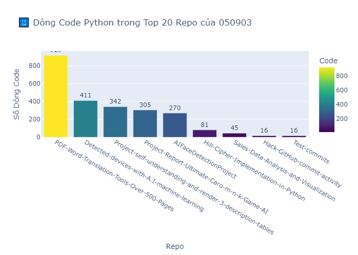

# 📊 Tổng quan dự án Python của 050903

Phân tích tổng cộng **9** repositories.

| Repo                                                       | PEP8_Score          |   Blank |   Comment |   Code |
|:-----------------------------------------------------------|:--------------------|--------:|----------:|-------:|
| PDF-Word-Translation-Tools-Over-500-Pages                  | Không thể chấm điểm |     181 |        56 |    919 |
| Detected-devices-with-A.I-machine-learning                 | 6.83/10             |     104 |        62 |    411 |
| Project-self-understanding-and-render-3-description-tables | 5.81/10             |      68 |        89 |    342 |
| Project-Report-Ultimate-Caro-m-n-k-Game-AI                 | 8.29/10             |      77 |       134 |    305 |
| AIFaceDetectionProject                                     | 4.60/10             |      42 |         9 |    270 |
| Hill-Cipher-Implementation-in-Python                       | 7.78/10             |      19 |         9 |     81 |
| Sales-Data-Analysis-and-Visualization                      | 8.75/10             |      11 |         7 |     45 |
| Hack-GitHub-commit-activity                                | 6.43/10             |       4 |         0 |     16 |
| Test-commits                                               | 6.43/10             |       4 |         0 |     16 |

## 📈 Biểu đồ dòng code

